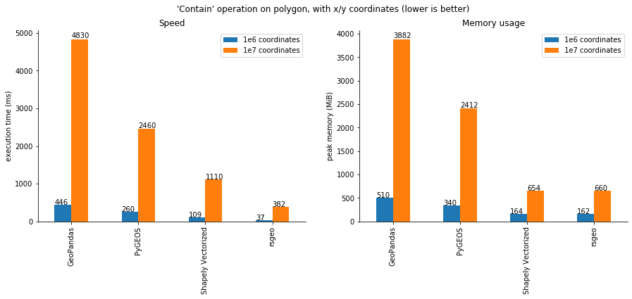

# RSGeo


Fast geospacial functions for Python implemented in Rust.

## Getting started
`rsgeo` works with numpy arrays, since these can be used by Rust as well. Let's say you want
to check for several (x, y) coordinates, if they are in a certain polygon.

```python
>>> from rsgeo.geometry import Polygon
>>> polygon = Polygon([(0.0, 0.0), (1.0, 1.0), (1.0, 0.0), (0.0, 0.0)])
>>> xs = np.array([1, 0, 2, 0.5])
>>> ys = np.array([1, 0, 2, 0.25])
>>> polygon.conains(xs, ys)
array([False, False, False, True])
```

This functionality is also implemented as a Pandas DataFrame accessor. This allows you to apply geospacial functions
directly on the Pandas DataFrames, like so:

```python
import pandas as pd

>>> df = pd.DataFrame(
...     {
...         "City": ["Amsterdam", "Rotterdam", "Utrecht", "Den Haag"],
...         "x_pos": xs,
...         "y_pos": ys,
...     }
... )
>>> df['within_polygon'] = df.rsgeo.isin(polygon)
>>> df['within_polygon']
0    False
1    False
2    False
3    True
name: within_polygon, dtype: bool
```

To make it fast, we use a Rust backend, in combination with the [geo](https://docs.rs/geo/0.15.0/geo/) crate.
And to keep the memory pressure low, we do not store point objects in memory, but generate them on the fly when 
performing the `contains` function, or the `distance` function.

## Performance
To give an indication, I've plotted a simple contains operation for multiple packages. 


And this is only the `contains` operation. `rsgeo` can also do a `distance` calculation for example!

